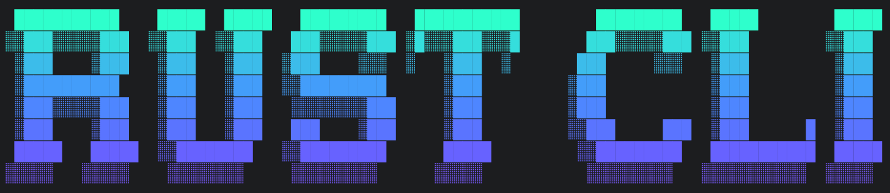
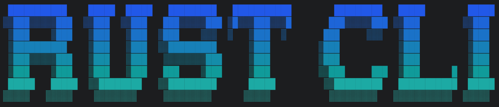
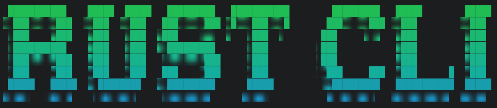
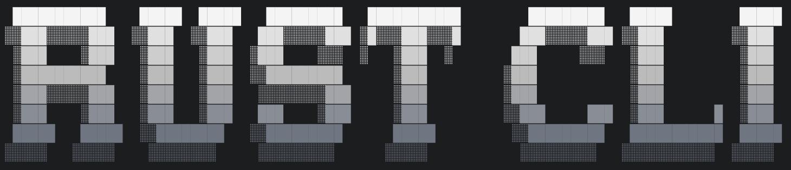
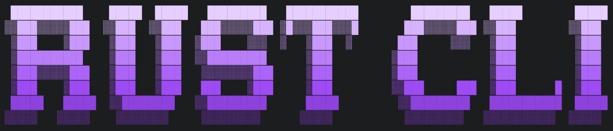
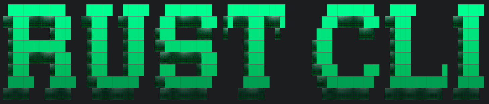

# tui-banner

Cinematic ANSI banners for Rust CLI/TUI.

## Features

- Grid-first rendering pipeline
- Bundled DOS Rebel (Figlet) font + load any `.flf`
- Truecolor / 256-color / no-color output with auto-detect
- Gradients, pixel fill, dithering, shadows, edge shading
- Named style and palette presets
- Fluent builder API

## Color Gallery

<table>
  <tr>
    <td align="center"><strong>Neon Cyber</strong><br></td>
    <td align="center"><strong>Arctic Tech</strong><br></td>
  </tr>
  <tr>
    <td align="center"><strong>Aurora Flux</strong><br></td>
    <td align="center"><strong>Deep Space</strong><br></td>
  </tr>
  <tr>
    <td align="center"><strong>Ocean Flow</strong><br></td>
    <td align="center"><strong>Sunset Neon</strong><br></td>
  </tr>
  <tr>
    <td align="center"><strong>Fire Warning</strong><br></td>
    <td align="center"><strong>Warm Luxury</strong><br></td>
  </tr>
  <tr>
    <td align="center"><strong>Forest Sky</strong><br></td>
    <td align="center"><strong>Earth Tone</strong><br></td>
  </tr>
  <tr>
    <td align="center"><strong>Chrome</strong><br></td>
    <td align="center"><strong>Royal Purple</strong><br></td>
  </tr>
  <tr>
    <td align="center"><strong>CRT Amber</strong><br></td>
    <td align="center"><strong>Matrix</strong><br></td>
  </tr>
</table>

## Quick Start

```toml
[dependencies]
tui-banner = { path = "." }
```

```rust
use tui_banner::{Align, Banner, Style};

fn main() -> Result<(), tui_banner::BannerError> {
    let banner = Banner::new("RUST CLI")?
        .style(Style::NeonCyber)
        .render();

    println!("{banner}");
    Ok(())
}
```

## Examples

```bash
cargo run --example neon_gradient_neon_cyber
cargo run --example neon_gradient_arctic_tech
cargo run --example neon_gradient_aurora_flux
cargo run --example neon_gradient_deep_space
cargo run --example neon_gradient_ocean_flow
cargo run --example neon_gradient_sunset_neon
cargo run --example neon_gradient_fire_warning
cargo run --example neon_gradient_warm_luxury
cargo run --example neon_gradient_forest_sky
cargo run --example neon_gradient_earth_tone
cargo run --example neon_gradient_chrome
cargo run --example neon_gradient_royal_purple
cargo run --example neon_gradient_crt_amber
cargo run --example neon_gradient_matrix
```
