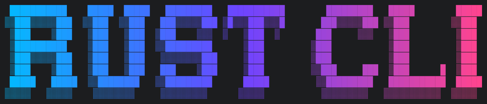
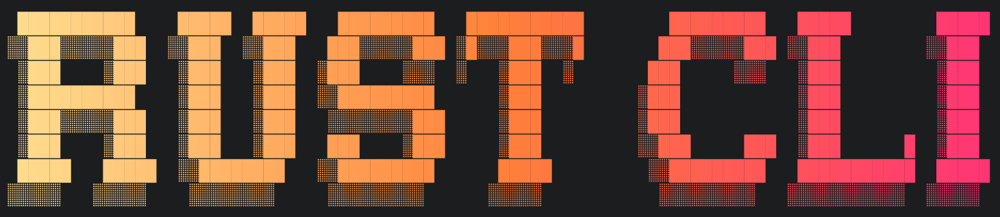
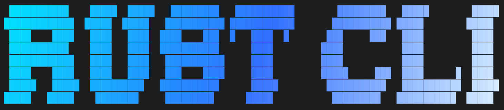
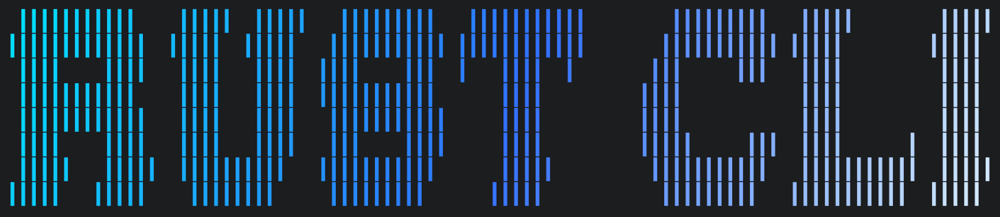
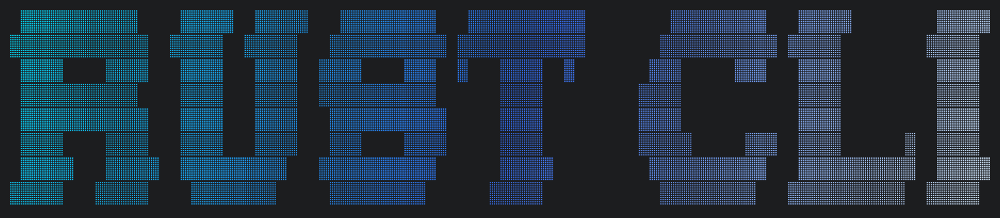
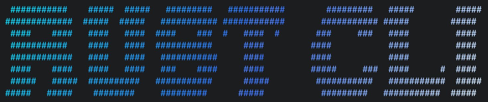

# tui-banner

Cinematic ANSI banners for Rust CLI/TUI.

[](https://crates.io/crates/tui-banner)
[](https://docs.rs/tui-banner/)
[](https://crates.io/crates/tui-banner)


## Features

- Grid-first rendering pipeline
- Bundled DOS Rebel (Figlet) font + load any `.flf`
- Truecolor / 256-color / no-color output with auto-detect
- Gradients, pixel fill, dithering, shadows, edge shading, light sweeps
- Named style and palette presets
- Fluent builder API

## Quick Start

```toml
[dependencies]
tui-banner = "0.1.4"
```

```rust
use tui_banner::{Align, Banner, Style};

fn main() -> Result<(), tui_banner::BannerError> {
    let banner = Banner::new("RUST CLI")?
        .style(Style::NeonCyber)
        .render();

    println!("{banner}");
    Ok(())
}
```

## Custom Gradient Example

```rust
use tui_banner::{Align, Banner, ColorMode, Fill, Gradient, Palette};

fn main() -> Result<(), tui_banner::BannerError> {
    let banner = Banner::new("RUST CLI")?
        .color_mode(ColorMode::TrueColor)
        .gradient(Gradient::vertical(Palette::from_hex(&[
            "#00E5FF", // cyan
            "#3A7BFF", // blue
            "#E6F6FF", // ice
        ])))
        .fill(Fill::Keep)
        .dither()
        .targets("░▒▓")
        .checker(3)
        .align(Align::Center)
        .padding(1)
        .render();

    println!("{banner}");
    Ok(())
}
```

## Light Sweep Animation

```rust
use tui_banner::{Align, Banner, Fill, Gradient, Palette};

fn main() -> Result<(), Box<dyn std::error::Error>> {
    let banner = Banner::new("RUST CLI")?
        .gradient(Gradient::diagonal(Palette::from_hex(&[
            "#00E5FF", "#7B5CFF", "#FF5AD9",
        ])))
        .fill(Fill::Keep)
        .align(Align::Center)
        .padding(1);

    banner.animate_sweep(2, None)?;
    Ok(())
}
```

Tip: pass `Some(Color::Rgb(...))` as the second argument to tint the sweep.


## Gradient Gallery

<table>
  <tr>
    <th>Vertical</th>
    <th>Horizontal</th>
  </tr>
  <tr>
    <td></td>
    <td></td>
  </tr>
  <tr>
    <th>Diagonal</th>
    <th>Apply</th>
  </tr>
  <tr>
    <td></td>
    <td></td>
  </tr>
</table>

## Full Gallery

<table>
  <tr>
    <th>Block</th>
    <th>Half Block</th>
  </tr>
  <tr>
    <td></td>
    <td></td>
  </tr>
  <tr>
    <th>Light Shade</th>
    <th>Char</th>
  </tr>
  <tr>
    <td></td>
    <td></td>
  </tr>
</table>

## Dither Gallery

<table>
  <tr>
    <th>Checker Stipple</th>
    <th>Coarse Halftone</th>
  </tr>
  <tr>
    <td></td>
    <td></td>
  </tr>
  <tr>
    <th>Film Grain</th>
    <th>Sparkle Noise</th>
  </tr>
  <tr>
    <td></td>
    <td></td>
  </tr>
</table>

## CLI Usage

Install the CLI (binary name: `tui-banner`):

```bash
Download the prebuilt binary from GitHub Releases and place it on your PATH:
https://github.com/coolbeevip/tui-banner/releases
```

```bash
# help
tui-banner

# normal
tui-banner --text "HELLO WORLD"
tui-banner --text "HELLO WORLD" --style neon-cyber
tui-banner --text "HELLO WORLD" --gradient diagonal --palette "#00E5FF,#7B5CFF,#FF5AD9"

# animate sweep
tui-banner --text "HELLO WORLD" --animate-sweep 3 --sweep-highlight "#DCEBFF"
tui-banner --text "HELLO WORLD" --animate-sweep 3 --sweep-highlight "#DCEBFF" --sweep-direction horizontal
tui-banner --text "HELLO WORLD" --animate-sweep 3 \
    --sweep-direction diagonal-up --sweep-width 0.3 --sweep-intensity 0.9 \
    --sweep-softness 2.5 --sweep-center 0.4 --sweep-highlight "#DCEBFF"

# animate wave
tui-banner --text "HELLO WORLD" --animate-wave 3
tui-banner --text "HELLO WORLD" --animate-wave 3 --wave-dim 0.45 --wave-bright 0.3
```

Defaults (CLI):
- `--text` is required
- Gradient: diagonal
- Palette: #00E5FF, #3A7BFF, #E6F6FF
- Fill: keep
- Dither targets: ░▒▓ (when dither enabled)
- Padding: 1
- Align: center
- Color mode: truecolor
- Sweep highlight: white

Tip: `--animate-wave` keeps glyph positions fixed and adds a breathing, scale-like shimmer.
You can tune it with `--wave-dim` (darker lows) and `--wave-bright` (brighter highs).

## Examples

```bash
cargo run --example gradient_neon_cyber
cargo run --example gradient_arctic_tech
cargo run --example gradient_aurora_flux
cargo run --example gradient_deep_space
cargo run --example gradient_ocean_flow
cargo run --example gradient_sunset_neon
cargo run --example gradient_fire_warning
cargo run --example gradient_warm_luxury
cargo run --example gradient_forest_sky
cargo run --example gradient_earth_tone
cargo run --example gradient_chrome
cargo run --example gradient_royal_purple
cargo run --example gradient_crt_amber
cargo run --example gradient_matrix
cargo run --example dither_checker_stipple
cargo run --example dither_coarse_halftone
cargo run --example dither_film_grain
cargo run --example dither_sparkle_noise
cargo run --example light_sweep
```
